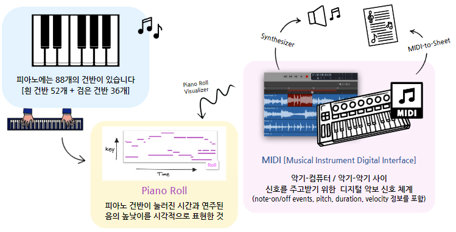
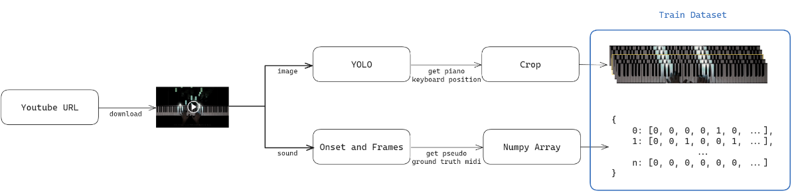
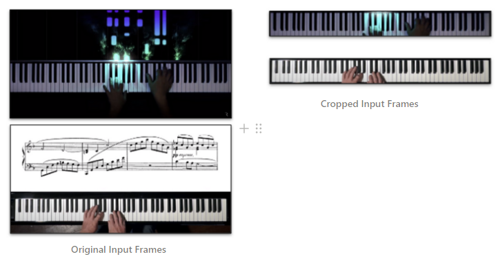
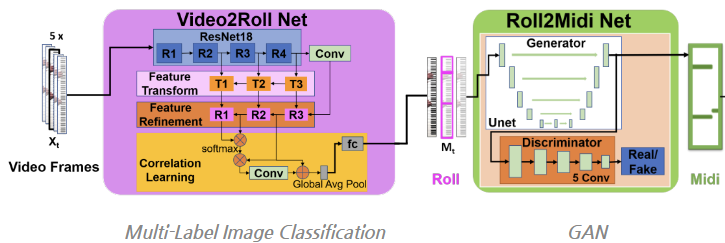
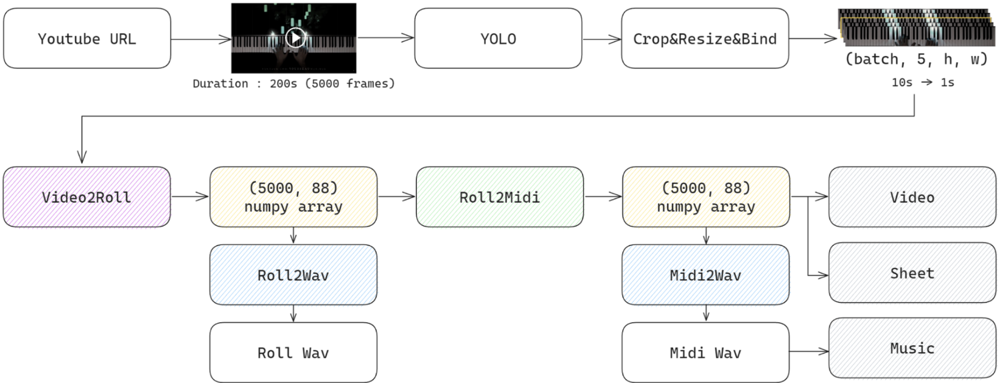
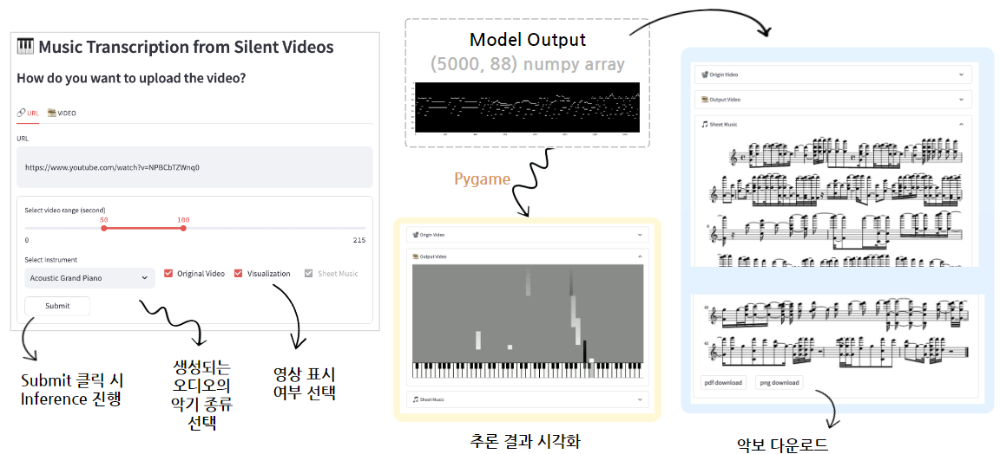

# :raised_hand: [Boostcamp-AI-Tech-Level3] HiBoostCamp :raised_hand:

<!-- ALL-CONTRIBUTORS-BADGE:START - Do not remove or modify this section -->
[](#contributors-)
[](#version-)
<!-- ALL-CONTRIBUTORS-BADGE:END -->

## 최종 프로젝트 목표
### 피아노 연주 영상에서 시각 정보만으로 악보 및 음악 파일 생성
<br>



<br>

## 개발 배경 및 필요성
- **온라인 영상**을 보고 동일한 곡을 연주하고 싶으나 **악보가 없어 어려움이 있음**
- 기존 악보 생성 모델들은 음원에 **노이즈가 많거나 여러 악기가 함께 녹음된 경우 사용할 수 없다는 단점**이 존재

<br>

## 해결 하려는 과제

1. Multi-Label Classification으로 각 프레임에서 연주된 건반 예측 ( Piano Roll )

2. 예측된 건반을 토대로 악보 생성!

<br>

## Model & Training

### 1. Dataset



#### 1.1. 영상 수집

- **유튜브에서 top-view 피아노 연주 연상 수집**

#### 1.2. Labeling

- [Onset and Frames](https://github.com/jongwook/onsets-and-frames)를 이용하여 프레임별 연주된 건반을 Pseudo-labeling

#### 1.3. Pre-Processing

- **유튜브 영상에서 키보드 영역만 추출하여 Input Images 구성**



### 2. Model

reference : *[Audeo: Audio Generation for a Silent Performance Video (Su et al., NeurIPS 2020)](https://arxiv.org/abs/2006.14348)*




**정확한 건반의 눌림 유무 파악을 위해 타겟 프레임과 전/후 각 2 프레임씩 포함하여 총 5 프레임을 입력으로 사용**

| Video2RollNet | 타겟 프레임의 눌러진 키를 추론하여 Piano Roll (5, 88) 출력 |
| --- | --- |
| Roll2MidiNet | Piano Roll을 보완하여 Pseudo MIDI (5, 88) 출력 (좀 더 깔끔한 Piano Roll 출력) |

### 3. Loss & Metric

**F1 - Score 사용**

$$
F1 = \frac{2 \times \text{Precision} \times \text{Recall}}{\text{Precision} + \text{Recall}}
$$

<br>

## Serving Process



<br>

## Baseline 모델
- _Su, Kun, Xiulong Liu, and Eli Shlizerman. "Audeo: Audio generation for a silent performance video." Advances in Neural Information Processing Systems 33 (2020): 3325-3337._
- _Gan, Chuang, et al. "Foley music: Learning to generate music from videos." Computer Vision–ECCV 2020: 16th European Conference, Glasgow, UK, August 23–28, 2020, Proceedings, Part XI 16. Springer International Publishing, 2020._


<br>

## 사용 중인 데이터 셋
- <a href="http://data.csail.mit.edu/clevrer/data_pose_midi.tar">Foley Music 논문에서 사용한 데이터셋</a>
- <a href="https://github.com/shlizee/Audeo">Audeo 논문에서 사용한 데이터셋</a>
- <a href="https://www.robots.ox.ac.uk/~vgg/research/sighttosound/">PianoYT 데이터셋</a>

<br>

## Repository 구조
- Repository 는 다음과 같은 구조로 구성되어있습니다. 

```

├── models
|      ├── make_wav.py
|      ├── roll_to_midi.py
|      └── video_to_roll.py
├── server_training
|      ├── dataset
|      ├── model
|      ├── tools
|      ├── trainer
|      ├── util
|      ├── notebooks
|            ...
├── README.md
├── frontend.py
├── game.py
├── generate_score.py
├── midi_file.py
├── preprocess.py
├── inferenec.py
└── process.py
```

<br>

## 역할 분담
| 역할 | 담당 개발자 |
| :-- | :--------- |
|Data Collection, Audeo Model Experiment, Research|이종목|
|Data Collection, Foley Model Experiment, Research|정성혜|
|데이터 전처리 개발 및 최적화, 악보 생성 파트 개발, Multi-Modal 실험|강나훈|
|frontend / backend|김근욱|
|Frontend Application 개발, Git Action CD 개발|김희상|

## Contributors?
<!-- ALL-CONTRIBUTORS-LIST:START - Do not remove or modify this section -->
<!-- prettier-ignore-start -->
<!-- markdownlint-disable -->
<table>
  <tr>
    <td align="center"><a href="https://github.com/ejrtks1020"><br /><sub><b>강나훈</b></sub></a><br /><a href="https://github.com/ejrtks1020" title="Code"></td>
    <td align="center"><a href="https://github.com/lijm1358"><br /><sub><b>이종목</b></sub></a><br /><a href="https://github.com/lijm1358" title="Code"></td>
    <td align="center"><a href="https://github.com/fneaplle"><br /><sub><b>김희상</b></sub></a><br /><a href="https://github.com/fneaplle" title="Code"></td>
    <td align="center"><a href="https://github.com/KimGeunUk"><br /><sub><b>김근욱</b></sub></a><br /><a href="https://github.com/KimGeunUk" title="Code"></td>
    <td align="center"><a href="https://github.com/jshye"><br /><sub><b>정성혜</b></sub></a><br /><a href="https://github.com/jshye" title="Code"></td>    
  </tr>
</table>
<!-- markdownlint-restore -->
<!-- prettier-ignore-end -->
<!-- ALL-CONTRIBUTORS-LIST:END -->
